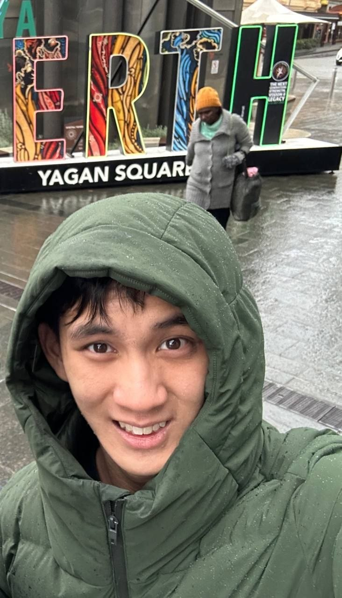
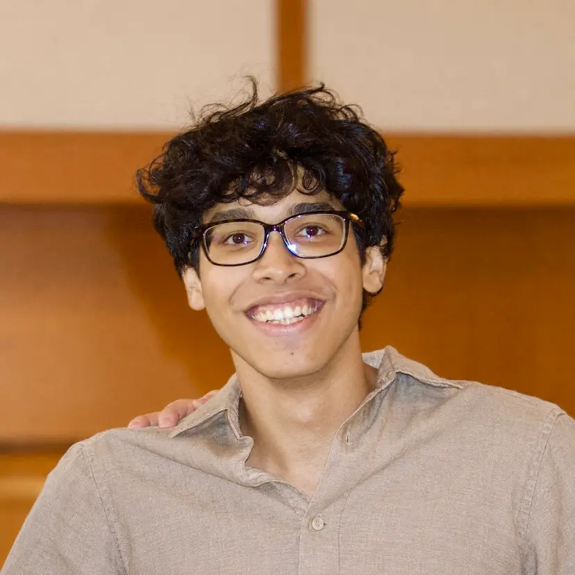
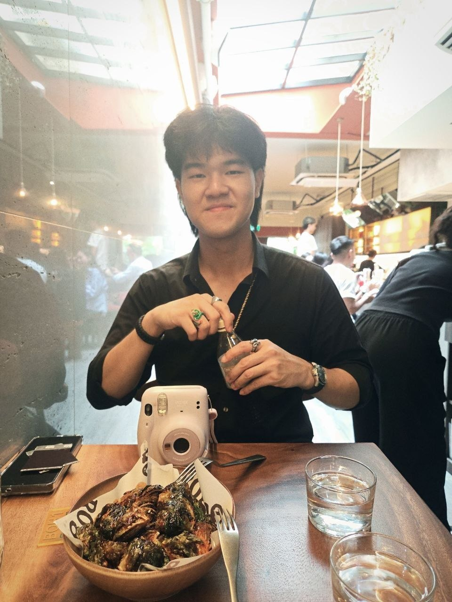
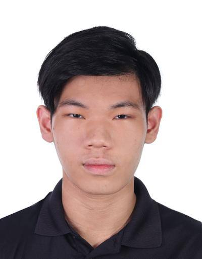

# About Us

We are a team based in the [School of Computing, National University of Singapore](http://www.comp.nus.edu.sg).

You can reach us at the email `seer[at]comp.nus.edu.sg`

## Project team

### Keegan Gan

[[github](https://github.com/keegan4)]

* Role: CS2103T Team Member
* Responsibilities: Testing

### Keith Chia Wen Kai

[[github](https://github.com/wtvlol)]

* Role: CS2103T Team Member
* Responsibilities: Some Features

### Arjo

[[github](https://github.com/ArjoDas)]

* Role: Team Member
* Responsibilities: Some Features

### Nicholas Vun

[[github](http://github.com/kimjunkuno)]
[[portfolio](team/kimjunkuno.md)]

### Choong Jen Ern Isaac

[[github](https://github.com/isaaaxe)]

* Role: Integration, CS2103/T student
* In charge of: Undo
